### Version 4.3.0 

---

The **AirfoilEditor** is a fast airfoil viewer, analyzer, and advanced geometry editor with integrated Xoptfoil2-based optimization. The app provides three operating modes:

#### View
* Browse and view airfoils in subdirectories
* Analyze curvature of airfoil surface
* Show polars generated using XFOIL
* Export airfoil to DXF format 

#### Modify
* Repanel and normalize airfoils
* Adjust thickness, camber, high points, and trailing edge gap
* Blend two airfoils
* Set flap
* Generate airfoil replicas using Bezier or B-Spline curves

#### Optimize
* User Interface of [Xoptfoil2](https://github.com/jxjo/Xoptfoil2)
* Graphical definition of polar based objectives
* View results while optimizing

The app was initially developed to address artifacts found in other tools like Xflr5 when using xfoil geometry routines. The aim has been an intuitive, user-friendly experience that encourages exploration.
The app, developed in Python with the Qt UI framework, runs on Windows, Linux, and MacOS. Linux and MacOS users are required to compile the underlying programs for polar viewing and airfoil optimization - see 'Installation' for details.

## Quick Start

* Windows (recommended): download and run the latest installer from the [GitHub releases page](https://github.com/jxjo/AirfoilEditor/releases).
* Python package: `pip3 install airfoileditor`, then run `airfoileditor`.
* Linux/macOS note: View and Modify mode work directly after installation; Polars and Optimize mode require compiled `worker` and `xoptfoil2` binaries.


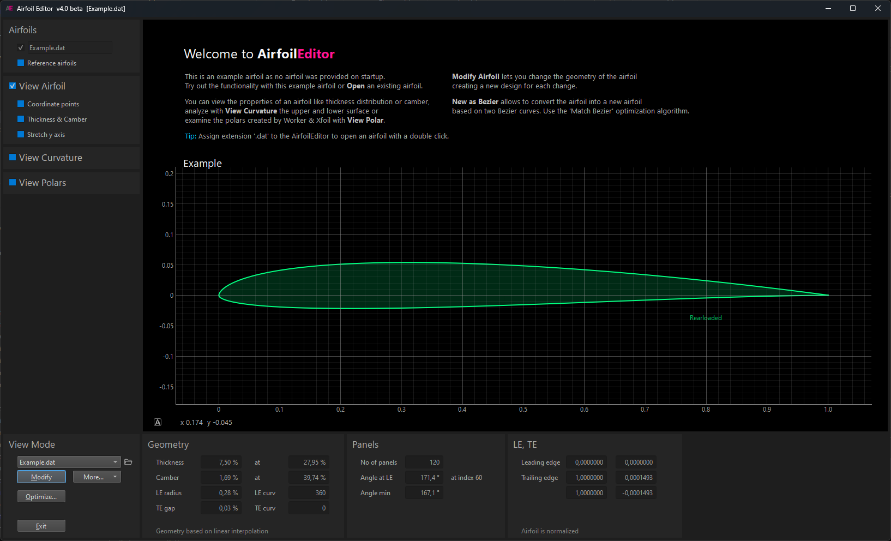

# Basic Concepts

## Geometry of an Airfoil

The **AirfoilEditor** utilizes various strategies to represent the geometry of an airfoil.

* 'Linear interpolation' – Using the point coordinates from the airfoils '.dat' file, intermediate points are calculated through linear interpolation. Used for quick previews and simple tasks.

* 'Cubic spline interpolation' – A cubic spline is created from the airfoil's point coordinates, enabling precise interpolation of intermediate points.

* 'Bezier curve' – An airfoil is modeled using two Bezier curves, one for the upper surface and one for the lower surface. Nelder-Mead optimization is used to fit these Bezier curves to an existing airfoil profile.

* 'B-Spline curve' – Quite similar to Bezier using two (segmented) B-Splines of degree 4 to represent an airfoil (experimental).

Spline interpolation is applied to determine the position of the actual leading edge, which can vary from the coordinate-based leading edge defined as the point with the smallest x-value. Airfoil normalization iteratively rotates, stretches, and shifts the airfoil so its leading edge based on the spline is at (0,0) and trailing edge at (1,0).

For thickness and camber geometry operations, the airfoil is divided into two separate splines representing the thickness and camber distributions. A mapping spline—similar to that in XFOIL—is applied to shift the high point of thickness or camber. The airfoil is then reconstructed from the adjusted thickness and camber splines.
This method also enables separate adjustment of the upper and lower surfaces' high points.


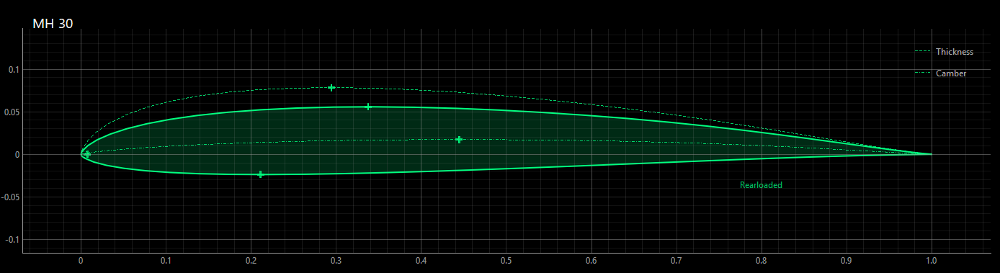

## Curvature

One of the major views in the AirfoilEditor is the airfoil's curvature. It provides quick assessment of surface quality and helps detect undesirable artifacts like a 'spoiler' at the trailing edge.

> [!TIP]
Have a look at the [Xoptfoil2 geometry documentation](https://jxjo.github.io/Xoptfoil2/docs/geometry) for more information about an airfoil's geometry.  

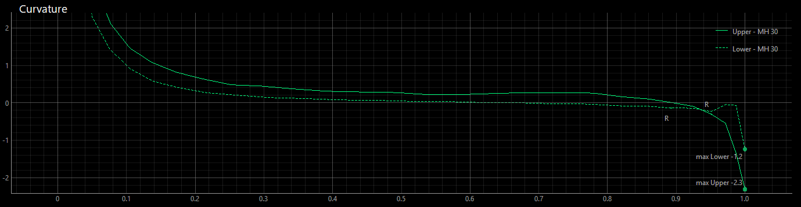


## Bezier and B-Spline based Airfoils

Beside `.dat` files, the AirfoilEditor seamlessly handles `.bez` files defining Bezier-based airfoils, and `.bsp` files for B-Spline-based airfoils.
While traditional airfoils are defined by coordinate points, Bezier and B-Spline airfoils are defined by curves with control points. This approach provides inherently smooth curvature along the airfoil surface.

B-Spline-based airfoils were introduced in version 4.3 of the **AirfoilEditor** to gain more flexibility in airfoil optimization due to the local character of B-Spline control points compared to Bezier control points, which act globally by definition. However, achieving acceptable C3/C4 continuity between B-Spline segments is challenging and essential for generating smooth XFOIL polars. Therefore, B-Spline airfoils are currently in an experimental state. 


In 'Modify Mode', control points can be moved directly in the diagram with the mouse to adjust the airfoil geometry. Each modification creates a new 'Design' with newly generated polars.

The match function (experimental for B-Spline) fits the curve to an existing airfoil as accurately as possible using simplex optimization (Nelder-Mead) to:

* Minimize the root mean square (rms) deviation between the curve and target airfoil
* Align the curvature at leading and trailing edges to the target
* Avoid bumps of the curvature  
* Ensure equal curvature at the leading edge on both surfaces

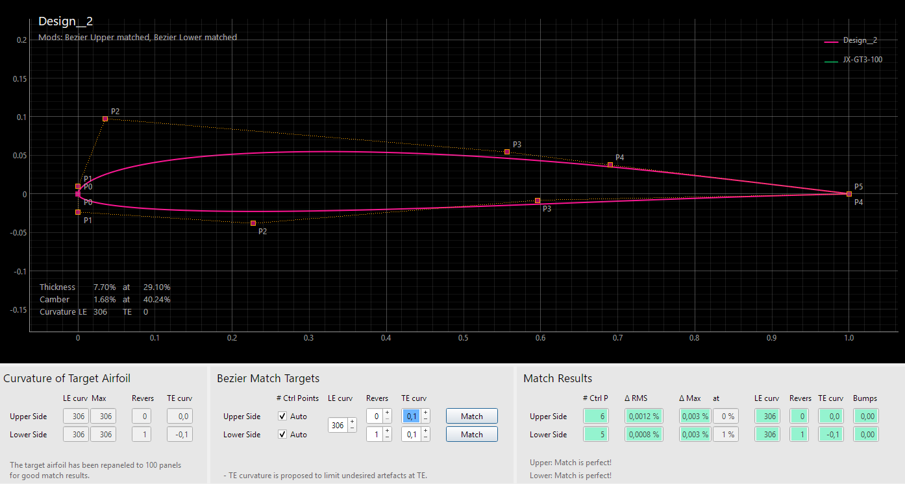


### Export to DXF 

Bezier- or B-Spline-based airfoils are especially useful for downstream work in 3D CAD, for example when building a wing from multiple airfoil sections.

The Export to DXF feature transfers curve-based airfoils as uniform B-splines with no loss of geometric precision. Since CAD systems also store curves internally as uniform B-splines, these exports are ideal for creating high-quality lofted 3D bodies.

Classic `.dat` airfoils are exported as cubic splines, which are widely supported and interpreted correctly by CAD software.

During export, the airfoil can be scaled to the chord length of a wing section and assigned a specific trailing-edge thickness.

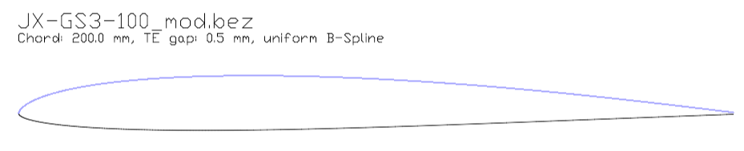


## Polars of an Airfoil

To generate the polars of an airfoil, the **AirfoilEditor** uses the Worker tool from the [Xoptfoil2 project](https://github.com/jxjo/Xoptfoil2). One of its functions is multi-threaded polar set generation using XFOIL.

For polar generation, the Worker's `auto_range` feature optimizes the alpha range to show the complete T1 polar from `cl_min` to `cl_max`. For T2 polars (constant lift), the range starts just above `cl=0.0` up to `cl_max`.

### Polars on Demand

Within the app, a polar is generated on demand when it needs to be displayed. If required, XFOIL polar generation executes asynchronously as a background task. Each generated polar is stored in an individual file using XFOIL's format for fast reuse. 

This method enables the sequential review of airfoils or airfoil designs, displaying the polars without requiring additional user input.

### Flapped Polars

A polar can be 'flapped', meaning the airfoil has temporary flaps set before XFOIL computes the polar. This is convenient for comparing different airfoils at a specific flap angle without manually adjusting and recalculating.

Alternatively, a flap can be set in 'Modify Mode' for an individual airfoil and saved as a separate airfoil. This is useful when the flapped airfoil is needed for further processing (for example, in XFLR5). 

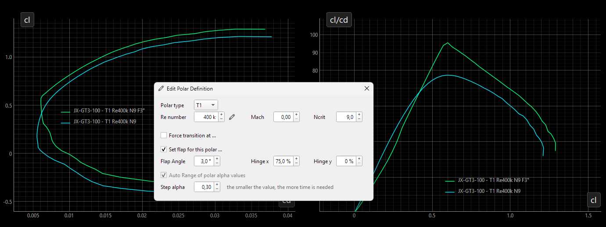

### Scaled Polars

When designing airfoils as wing sections along the wing span, they must be compared at different Reynolds numbers corresponding to each section's chord length. This is supported by defining a 'scale' value (in percent) for the reference airfoils of the main airfoil. 

This allows comparison of wing airfoils using a single polar definition for the main airfoil.

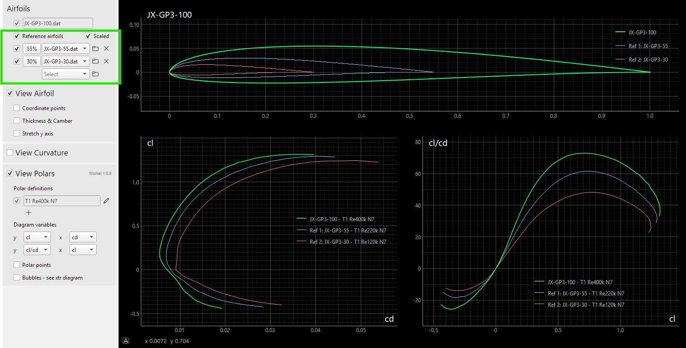


# 1. View Mode

Upon launch, AirfoilEditor opens in 'View Mode', which serves as the app’s default mode.

The 'View Mode' provides an overview of the geometric properties and polars of an airfoil. Since all airfoil parameters are read-only, there is no risk of making unintended changes to the airfoil file.

Using the mouse wheel on the airfoil selection combo box allows for efficient browsing of airfoils within a subdirectory.

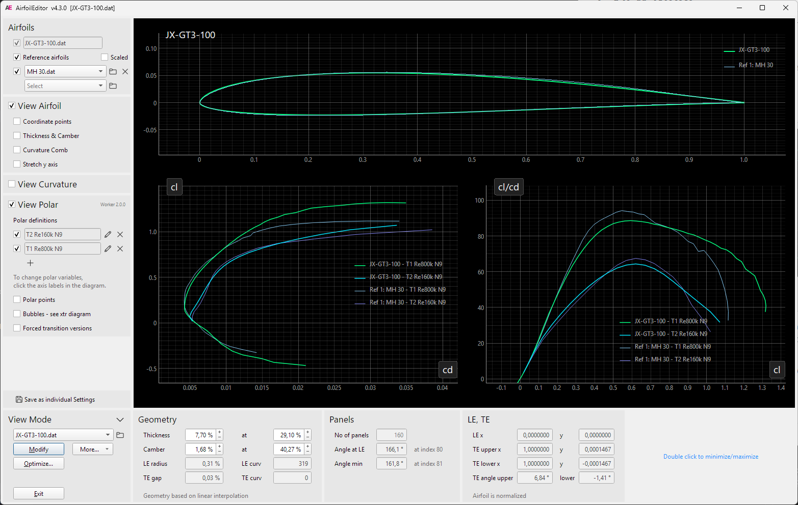


Reference airfoils can be added to compare the current airfoil against other airfoils. This enables side-by-side analysis of geometric properties and polar characteristics.

The current view settings can be saved for an airfoil. When opening the airfoil again, these settings will be applied.


# 2. Modify Mode

Modify Mode enables you to change the geometry of an airfoil.

In Modify Mode, many airfoil parameters can be changed by entering new values in data fields or moving helper points in the diagram. 

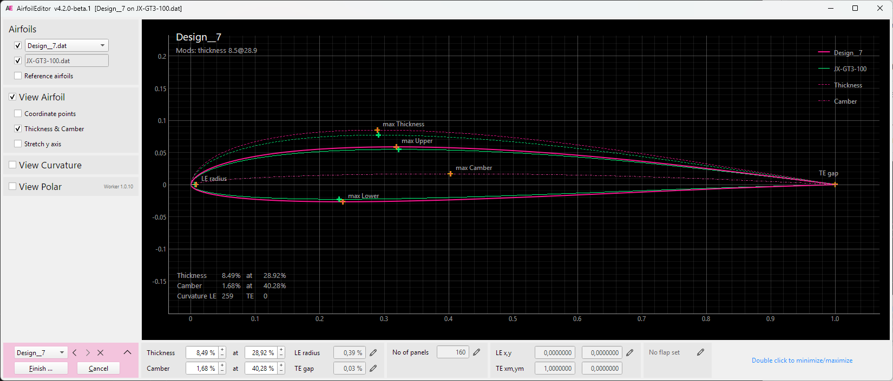

## Airfoil Designs

A key feature is that every modification creates a new 'Design' version of the airfoil, saved in a subdirectory related to the original airfoil. This allows you to leave 'Modify Mode', re-enter later, and find all your Designs from the last session.
At any time, you can step through the created Designs and compare the changes and their effects on the polar.   

As the polar(s) of each Design is created automatically, it becomes easy to see how airfoil modifications relate to polar changes. 

> [!TIP]
Adjust the camber highpoint position and observe its impact on polars at different Reynolds numbers. This approach helps you understand airfoil geometry interactively…

## Setting Flap

One of the possible modifications is to set a trailing edge flap: either permanently or to assess its influence on the airfoil's polar.

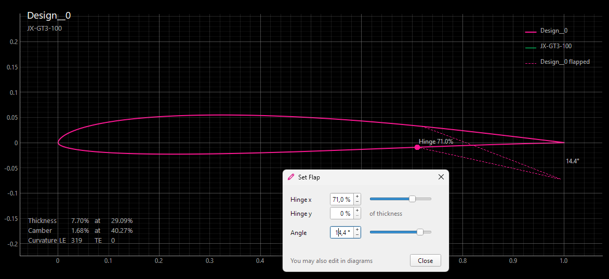

Note: A flap cannot be set on an already 'flapped' airfoil. The app remembers the initial unflapped design airfoil, enabling multiple sequential flap settings to be applied during a design session.

## Bezier and B-Spline based Airfoils (Modify Mode)

Bezier-based and B-Spline-based airfoils can also be adjusted in 'Modify Mode'. Since their geometry is defined by curves rather than coordinate points, traditional parameters like thickness cannot be changed directly.

For trailing edge gap adjustments on curve-based airfoils, new control point coordinates are calculated using a smooth interpolation function to preserve curve quality.

Instead, control points of the curves can be moved directly in the diagram with the mouse. Each modification results in a new 'Design' with newly generated polars, making it easy to observe how adjustments impact aerodynamic performance.


# 3. Optimization Mode

In 'Optimization Mode', the **AirfoilEditor** serves as a wrapper for [Xoptfoil2](https://github.com/jxjo/Xoptfoil2).

Xoptfoil2 is a particle-swarm-based airfoil optimizer that supports different 'shaping methods' to modify the airfoil during optimization: 

*	Bezier curves defining the shape
*	Hicks-Henne shape functions
*	B-Spline shape functions (experimental)
*	Geometry constraints for defining allowed variations

The **AirfoilEditor** covers all steps needed for airfoil optimization with Xoptfoil2: 

*	Define an optimization case with the objectives and boundary conditions
*	Run, control and watch an optimization  
*	Analyze the results 
*	Improve the specifications and re-run

Compared to manual editing of Xoptfoil2's input file, the user interface greatly streamlines defining operating points and objectives.

Multiple versions of an optimization case can be created, making it easier to select the best version at the end of your optimization sessions.

> [!IMPORTANT]
> Before you start your own airfoil optimizations with the **AirfoilEditor**, you should fully understand the key concepts of Xoptfoil2 and the special terms like 'seed airfoil' or 'operating point'. 
> Please read carefully the chapters [Getting Started](https://jxjo.github.io/Xoptfoil2/docs/getting_started) and [Airfoil Optimization](https://jxjo.github.io/Xoptfoil2/docs/airfoil_optimization) of the Xoptfoil2  documentation. 
>You will find the example of 'Getting Started' is ready to go in the AirfoilEditor making it easy to watch and modify your first optimization. 


## Setting up an Optimization Case

The main task when setting up a new optimization case is to define the 'operating points' on a (virtual) polar and choose the objective type for each of these operating points. 

Within the polar diagram of the AirfoilEditor operating points can be added, deleted or moved with the mouse. A little dialog allows to enter additional specifications for the selected operating point.

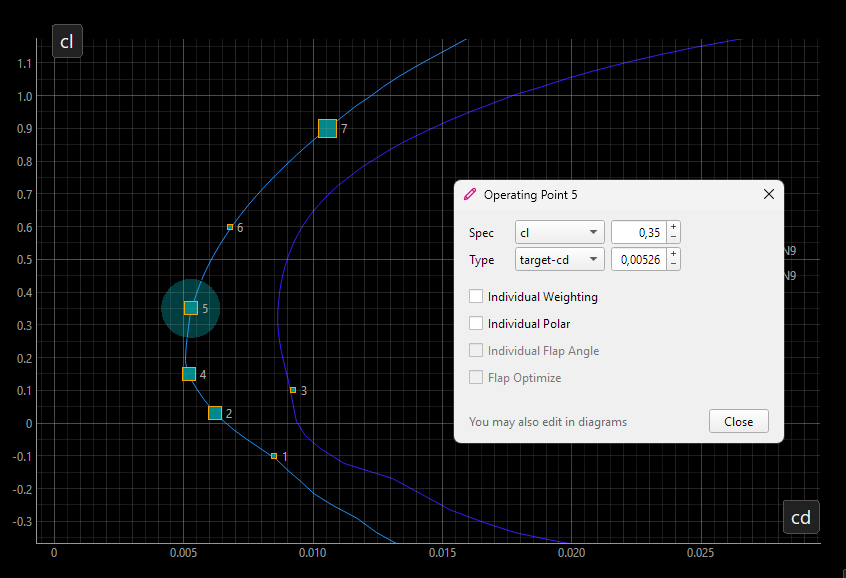

If a different polar (e.g. Reynolds Number) is defined for an operating point, this polar will be automatically added to the list of polars and displayed in the diagram.

An individual weighting is visualized by the size of the symbol in the diagram.

In the lower data panel of the AirfoilEditor nearly all of the numerous options of Xoptfoil2 can be modified according to the needs of the optimization. 

The button 'Input File' opens a text editor showing the current Xoptfoil2 input file that would be used for the optimization. You can tweak it with this editor (or an external editor) to cover special situations.  

Once the definition of the optimization case is finished, the optimization is ready to go.


## Run an Optimization 

When an optimization starts, the diagram area is automatically maximized for full visibility of what's happening. Since Xoptfoil2 optimization runs as a background task, you can change view settings, pan, and zoom the diagram as needed during optimization.

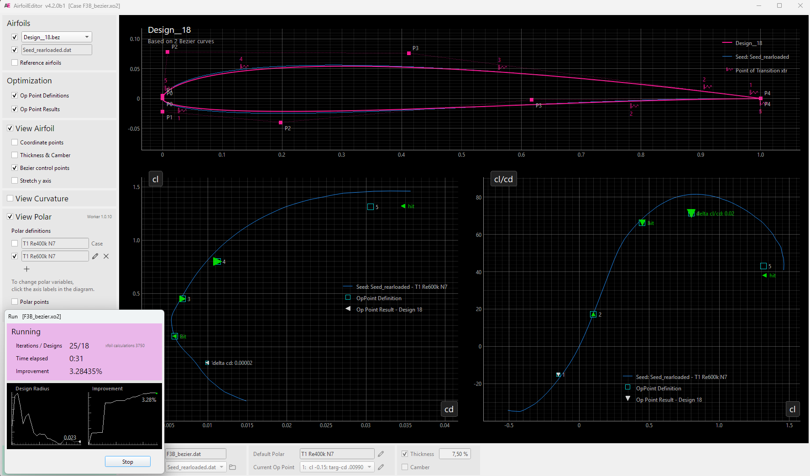


After the optimization finishes, a new final airfoil is created. You can review the numerous Designs from the optimization process, analyze the final airfoil's properties, and if necessary, modify objectives and re-run. Creating a new version when changing parameters allows you to roll back to a better version if needed.    
   

# Installation

### Windows Easy Setup

A ready-built Windows app including Worker for polar generation and Xoptfoil2 for airfoil optimization is available in the [releases section on GitHub](https://github.com/jxjo/AirfoilEditor/releases).

Download the Windows installer and run it to install the app.

### Windows Setup using Python

If you already have Python version >=3.12 installed, it's advantageous to install AirfoilEditor as a package. It will start faster than the standalone .exe file and already includes Worker and Xoptfoil2. 

Install the app:
```
pip3 install airfoileditor 
```

To upgrade to the latest version, use `pip3 install airfoileditor -U`.

Run the app by typing `airfoileditor` on the command line.

If you want to try the app and ensure the installation doesn't affect other packages, you may prefer installing in a virtual environment. For daily use, a normal installation is more convenient.


### Linux and MacOS

The app is installed as a Python 'package'. Please ensure to have a Python version >=3.12.

View and Modify mode work after package installation. Polars and Optimize mode additionally require compiled `worker` and `xoptfoil2` binaries.

```
pip3 install airfoileditor 
```

To upgrade to the latest version, use `pip3 install airfoileditor -U`.

Run the app by typing `airfoileditor` on the command line.

#### Preparing Xoptfoil2 and Worker
To use polar generation and airfoil optimization the two programs `worker` and `xoptfoil2` have to be compiled and made available for the AirfoilEditor by copying the two programs into /usr/local/bin. 

Please have a look into [Xoptfoil2 README Installation](https://github.com/jxjo/Xoptfoil2) for further information.

As a bonus for the extra setup effort, polar generation and airfoil optimization typically run 2-3 times faster on Linux than on Windows.

#### Ubuntu

If there is warning message like "Failed to create wl_display" when starting the app, set a QT environment variable with `export QT_QPA_PLATFORM=xcb`.

### Cloning from GitHub

If you want to clone the AirfoilEditor repository from GitHub for local development, install the following packages in your Python environment: 

```
pip install  "numpy~=2.2.0"
pip install  "packaging>=24.0"
pip install  "requests"
pip install  "pyqt6>=6.9.1"
pip install  "pyqtgraph>=0.13.7"
pip install  "f90nml>=1.4.4"
pip install  "termcolor>=2.3.0"
pip install  "platformdirs>=4.3.0"
pip install  "ezdxf>=1.4.0"
```

### Changelog

See [CHANGELOG.md](CHANGELOG.md) for history of changes.
# Finally 

I hope you enjoy working with the **AirfoilEditor**.

> [!TIP]
For Windows: Use the "Open with ..." Explorer command to associate AirfoilEditor.exe with the `.dat` extension. Then double-clicking a `.dat` airfoil file will open AirfoilEditor and allow browsing other files in the same directory. If you use the Python package version, create a small batch script to open `.dat` files.
