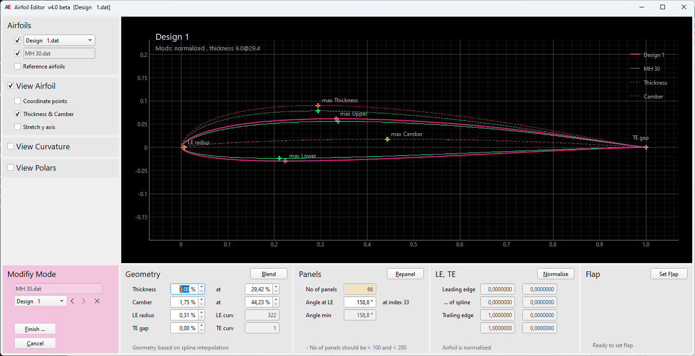
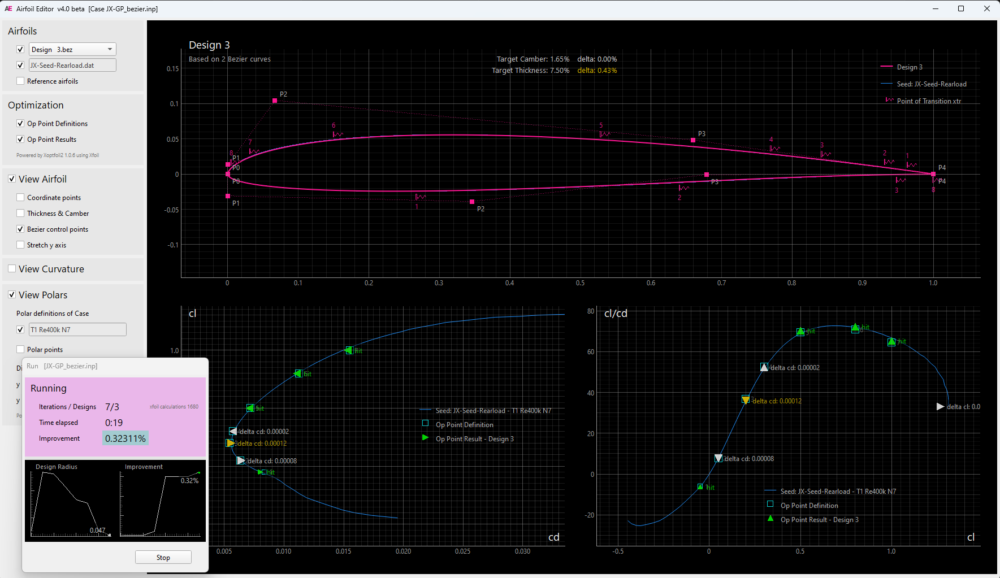

### Version 4.2.5

---

The **AirfoilEditor** is a fast airfoil viewer and advanced geometry editor with integrated Xoptfoil2-based optimization. The app provides three operating modes:

#### View
* Browse and view airfoils in subdirectories
* Analyze curvature of airfoil surface
* Show polars generated using XFOIL

#### Modify
* Repanel and normalize airfoils
* Adjust thickness, camber, high points, and trailing edge gap
* Blend two airfoils
* Set flap
* Generate airfoil replicas using Bezier curves.

#### Optimize
* User Interface of [Xoptfoil2](https://github.com/jxjo/Xoptfoil2)
* Graphical definition of polar based objectives
* View results while optimizing

The app was initially developed to address artifacts found in other tools like Xflr5 when using xfoil geometry routines. The aim has been an intuitive, user-friendly experience that encourages exploration.
The app, developed in Python with the Qt UI framework, runs on Windows, Linux, and MacOS. Linux and MacOS users are required to compile the underlying programs for polar viewing and airfoil optimization - see 'Installation' for details.


# Basic Concepts

## Geometry of an Airfoil

The AirfoilEditor utilizes various strategies to represent the geometry of an airfoil.

* 'Linear interpolation' – Using the point coordinates from the airfoils '.dat' file, intermediate points are calculated through linear interpolation. Used for quick previews and simple tasks.

* 'Cubic spline interpolation' – A cubic spline is created from the airfoil's point coordinates, enabling precise interpolation of intermediate points.

* 'Bezier curve' – An airfoil is modeled using two Bezier curves, one for the upper surface and one for the lower surface. Nelder-Mead optimization is used to fit these Bezier curves to an existing airfoil profile.

Spline interpolation is applied to determine the position of the actual leading edge, which can vary from the coordinate-based leading edge defined as the point with the smallest x-value. Airfoil normalization iteratively rotates, stretches, and shifts the airfoil so its leading edge based on the spline is at (0,0) and trailing edge at (1,0).

For thickness and camber geometry operations, the airfoil is divided into two separate splines that represent the thickness and camber distributions. To shift the high point of thickness or camber, a mapping spline - similar to that in xfoil - is applied to the thickness or camber spline. The airfoil is then reconstructed from the adjusted thickness and camber spline.
This method is also used to adjust the highpoint of both the upper and lower surfaces of the airfoil, allowing for separate modification of each side.


## Curvature

One of the main views in AirfoilEditor is the curvature of the airfoil surface. It enables a quick assessment of surface quality and helps detect artifacts such as a trailing-edge 'spoiler', which is fairly common.

Curvature can be displayed as a 'curvature comb' directly on the surface or shown in more detail in a separate diagram.


> [!TIP]
Have a look at the [documentation of Xoptfoil2](https://jxjo.github.io/Xoptfoil2/docs/geometry) for more information about an airfoils geometry.  


## Bezier based airfoils

Beside .dat files the AirfoilEditor seamlessly handles .bez files defining a Bezier based airfoil. 
While a normal airfoil is defined by coordinate points, a Bezier based airfoil is defined by two Bezier curves for upper and lower side. 

A Bezier curve itself is defined by control points. One significant benefit of utilizing a Bezier curve is its ability to provide a consistently smooth curvature along the airfoil surface.   

The AirfoilEditor supports a manual mode, where the control points can be moved with the mouse to create the desired airfoil and an automatic mode with a match function:
The match function fits the Bezier curve to an existing airfoil as accurately as possible. For this a simplex optimization (Nelder Mead) is performed to

* minimize the norm2 deviation between the Bezier curve and a target airfoil
* align the curvature of the Bezier curve at leading and trailing to the curvature of the target.
* ensure the curvature at leading edge on upper and lower side is equal


## Polars of an Airfoil

To generate the polars of an airfoil the AirfoilEditor uses the Worker tool of the [Xoptfoil2 project](https://github.com/jxjo/Xoptfoil2). On of the Worker actions is the multi-threaded creation of a polar set using Xfoil.

For polar generation the auto_range feature of the Worker is applied which optimizes the alpha range of the polar to show the complete T1 polar from cl_min to cl_max of the airfoil. For T2 polars (constant lift) the range starts right above cl=0.0 to cl_max.

### Polars on Demand

Within the app, a polar is generated on demand at the time it needs to be displayed. If a polar is required, a Xfoil polar generation will be executed asynchronously in a background task. Each generated polar is stored in an individual file using the Xfoil polar format for fast access if the polar is needed again. 

This method enables the sequential review of airfoils or airfoil designs, displaying the polars without requiring additional user input.

### Flapped Polars

A polar can be 'flapped', meaning the airfoil has temporary flaps set before XFOIL computes the polar data. 
A 'flapped polar' is convenient when different airfoils should be compared having set a certain flap angle as setting a flap and calculating the associated polar is done on the fly.

In difference, a flap can be configured in 'Modify Mode' for an individual airfoil and saved as a separate airfoil. This method is used when the modified flapped airfoil is needed for further processing for example in Xflr5. (see 'Modification of an Airfoil') 


### Scaled Polars

When designing airfoils as wing sections along the wing span, the airfoils have to be compared with different Reynolds numbers according to the chord length of the wing section. The comparison of wing sections is supported by defining a 'scale' value in percent for the reference airfoils of the main airfoil. 

This allows to compare the airfoils of a wing with a single polar definition for the main airfoil.


### Separation Bubbles

The AirfoilEditor visualizes laminar separation bubbles in the polar diagrams. Xfoil identifies these regions by detecting areas of negative shear stress. In the transition diagram (Xtr), the length of a separation bubble at a certain value of cl (or alpha) is displayed.

When a bubble bursts into turbulent separation - indicated by the reattachment point falling behind the laminar-to-turbulent transition point - this results in further increased drag. As this turbulent separation bubble have an high impact on airfoil design, these bubbles are highlighted.

Small triangle markers in the polar diagrams indicate operating points where a bubble has formed on either the upper or lower surface of the airfoil.


### Forced Transition

Forced transition from laminar to turbulent flow, for example through a turbulator or trip strip, prevents the formation of separation bubbles.

In the polar definition, such a forced transition point can be specified. The value corresponds to the Xfoil parameters XtripT (top) and XtripB (bottom).

In the polar diagrams, the region where forced transition is effective is indicated by a dashed line.

The following diagram shows the same polar as in the previous separation bubble example, but with forced transition on the upper surface at 70% chord.


# 1. View Mode

Upon launch, AirfoilEditor opens in 'View Mode', which serves as the app’s default mode.

The 'View Mode' provides an overview of the geometric properties and polars of an airfoil. Since all airfoil parameters are read-only, there is no risk of making unintended changes to the airfoil file.

Using the mouse wheel on the airfoil selection combo box allows for efficient browsing of airfoils within a subdirectory.


Reference airfoils can be added to compare the current airfoil against other airfoils. This enables side-by-side analysis of geometric properties and polar characteristics.

The current view settings can be saved for an airfoil. When opening the airfoil again, these settings will be applied.


# 2. Modify Mode

To change the geometry of an airfoil, the 'Modify Mode' is entered by pressing the 'Modify' button.

In the 'Modify Mode' a lot of airfoil parameters can be changed either by entering new values in the data fields or by moving helper points in the diagram. 



## Airfoil Designs

A key feature of the AirfoilEditor is that every modification creates a new 'Design' version of the airfoil.

Such a 'Design' airfoil is saved in a subdirectory related to the original airfoil. This allows to leave the 'Modify Mode', re-enter later and find all the Designs of the last session. 
At every time you may step through the created Designs and compare the changes and the effects of the modifications on the polar.   

As the polar(s) of each Design is created automatically, it becomes very easy to see how airfoil modifications relate to polar changes. 

> [!TIP]
Adjust the camber highpoint position and observe its impact on polars at different Reynolds numbers. This approach helps you understand airfoil geometry interactively…

## Setting Flap

One of the possible modifications is to set a trailing edge flap – either permanently or just to assess to the influence of a flap setting on the polar of the airfoil.


Remark: As a flap may not be set on an already 'flapped' airfoil, the app remembers the initial unflapped design airfoil. This enables multiple sequential flap settings to be applied during a design session.

## Bezier based Airfoils

Bezier-based airfoils can also be adjusted in 'Modify Mode'. As the geometry of such an airfoil is defined by two Bezier curves for the upper and lower side, the typical geometry parameters like thickness cannot be changed directly. 

Instead, the control points of the Bezier curves can be moved with mouse directly in the diagram.
Each modification results in a new 'Design' with newly generated polars. This allows for observation of how adjustments to the Bezier curve impact the polar.

The optional match function fits the Bezier curve to an existing airfoil as accurately as possible. 


# 3. Optimization Mode

In 'Optimization Mode', the AirfoilEditor serves as a wrapper for [Xoptfoil2](https://github.com/jxjo/Xoptfoil2).

Xoptfoil2 is a particle swarm based airfoil optimizer which supports different 'shaping methods' to modify the airfoil during optimization: 

*	Hicks-Henne shape functions
*	Bezier curve defining the shape
*	Geometry parameters like maximum thickness and its position

The AirfoilEditor covers all steps needed for airfoil optimization with Xoptfoil2: 

*	Define an optimization case with the objectives and boundary conditions
*	Run, control and watch an optimization  
*	Analyze the results 
*	Improve the specifications and re-run

Compared to manual editing the input file of Xoptfoil2, the user interface greatly streamlines the process of defining and entering operating points being objectives of the optimization.

Multiple versions of an optimization case can be created, making it easier to finally select the best version  at the end of the optimization sessions.

> [!IMPORTANT]
> Before you start your own airfoil optimizations with the AirfoilEditor, you should fully understand the key concepts of Xoptfoil2 and the special terms like 'seed airfoil' or 'operating point'. 
> Please read carefully the chapters [Getting Started](https://jxjo.github.io/Xoptfoil2/docs/getting_started) and [Airfoil Optimization](https://jxjo.github.io/Xoptfoil2/docs/airfoil_optimization) of the Xoptfoil2  documentation. 
>You will find the example of 'Getting Started' is ready to go in the AirfoilEditor making it easy to watch and modify your first optimization. 


## Setting up an Optimization Case

The main task when setting up a new optimization case is to define the 'operating points' on a (virtual) polar and to choose the type of objective for each of this operating points. 

Within the polar diagram of the AirfoilEditor operating points can be added, deleted or moved with the mouse. A little dialog allows to enter additional specifications for the selected operating point.


If a different polar (e.g. Reynolds Number) is defined for an operating point, this polar will be automatically added to the list of polars and displayed in the diagram.

An individual weighting is visualized by the size of the symbol in the diagram.

In the lower data panel of the AirfoilEditor nearly all of the numerous options of Xoptfoil2 can be modified according to the needs of the optimization. 

The button 'Input File' opens a text editor with the current Xoptfoil2 input file which would be used for the optimization. The input file may be tweaked with this editor (or an external editor) to cover special situations.  

Once the definition of the optimization case is finished, the optimization is ready to go.


## Run an Optimization 

When an optimization is started, the diagram area of the AirfoilEditor is automatically maximized to have full view of what is happening during the optimization. 

As the Xoptfoil2 optimization is a background task, you may change the view settings, pan and zoom the diagram to your needs while the optimization is running.




When the optimization is finished a new, final airfoil will be created. 

You may have a look at the numerous Designs of the optimization process, analyze the properties of the final airfoil and if necessary, change the objectives of the optimization and re-run the optimization. 

Doing such iterations it is very helpful to create a new version when changing the parameters of the optimization. This allows to roll back to a former version which might have been better.    
   

# Installation

### Windows Easy Setup

A Windows Installer including Worker for polar generation and Xoptfoil2 for airfoil optimization is available in the [releases section on GitHub](https://github.com/jxjo/AirfoilEditor/releases).

Download and run the setup program. During installation, you may define whether the file extension .dat (and .bez for Bezier based airfoils) shall be assigned to the AirfoilEditor. 

When running the downloaded setup file, Windows SmartScreen may display a warning: "Windows protected your PC" with "Unknown publisher". **This is normal** for open-source software distributed without a code signing certificate.

To install in this case:
1. Click "More info"
2. Click "Run anyway"


### Windows Setup using Python

If you already have installed Python version >=3.12, it is advantageous to install the AirfoilEditor as a 'package'. 
This will startup the app faster than using the standalone .exe file. 
The package already includes Worker and Xoptfoil2. 

Install the app:
```
pip install airfoileditor 
```

To upgrade to the actual version use `pip install airfoileditor -U`.

Run the app by typing `airfoileditor` on the command line.

The command `where airfoileditor.exe` will show, where Python installed the program within your filesystem.
This file path can be used to create a shortcut on your desktop or to assign the file extension '.dat' to the app,  allowing to open an airfoil with a double click. 

If you just want to try out the app and want to ensure, that the installation doesn't influence other packages, you may prefer to install the package in an 'virtual environment'. For daily use a 'normal' installation is more convenient.


### Linux and MacOS

The app is installed as a Python 'package'. Please ensure to have a Python version >=3.12.

```
pip3 install airfoileditor 
```

To upgrade to the actual version use `pip3 install airfoileditor -U`.

Run the app by typing `airfoileditor` on the command line.

The command `which airfoileditor` will show, where Python installed the program within your filesystem.
This file path can be used to create a shortcut on your desktop or to assign the file extension '.dat' to the app,  allowing to open an airfoil with a double click. 


#### Preparing Xoptfoil2 and Worker
To use polar generation and airfoil optimization the two programs `worker` and `xoptfoil2` have to be compiled and made available for the AirfoilEditor by copying the two programs into /usr/local/bin. 

Please have a look into [Xoptfoil2 README Installation](https://github.com/jxjo/Xoptfoil2) for further information.

As a little reward for the extra effort polar generation and airfoil optimization will run 2-3 times faster on Linux compared to the Windows version.

#### Ubuntu

If there is warning message like "Failed to create wl_display" when starting the app, set a QT environment variable with `export QT_QPA_PLATFORM=xcb`.

### Cloning from Github

If you want to clone the AirfoilEditor repo from GitHub for local development, the following package have to be installed in your (virtual) python environment 

```
pip install  "numpy~=2.2.0"
pip install  "packaging>=24.0"
pip install  "requests"
pip install  "pyqt6>=6.9.1"
pip install  "pyqtgraph>=0.13.7"
pip install  "f90nml>=1.4.4"
pip install  "termcolor>=2.3.0"
pip install  "platformdirs>=4.3.0"
```

### Changelog

See [CHANGELOG.md](CHANGELOG.md) for history of changes.


# Finally 

I hope you enjoy working with the **AirfoilEditor** 🚀
