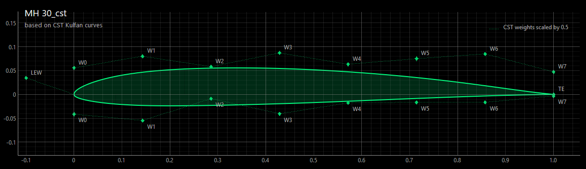
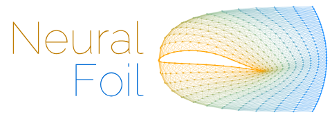
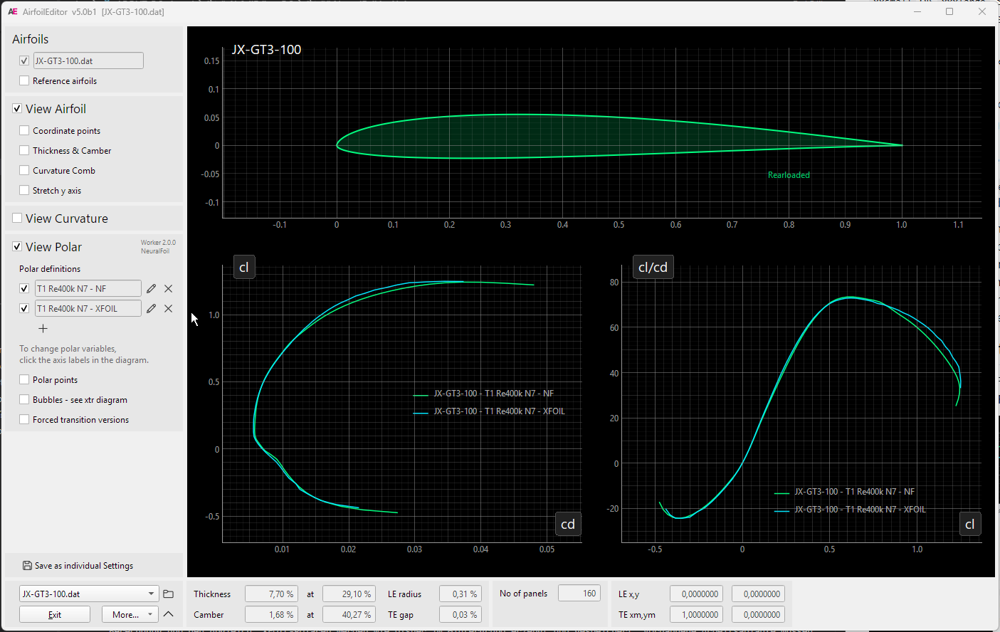
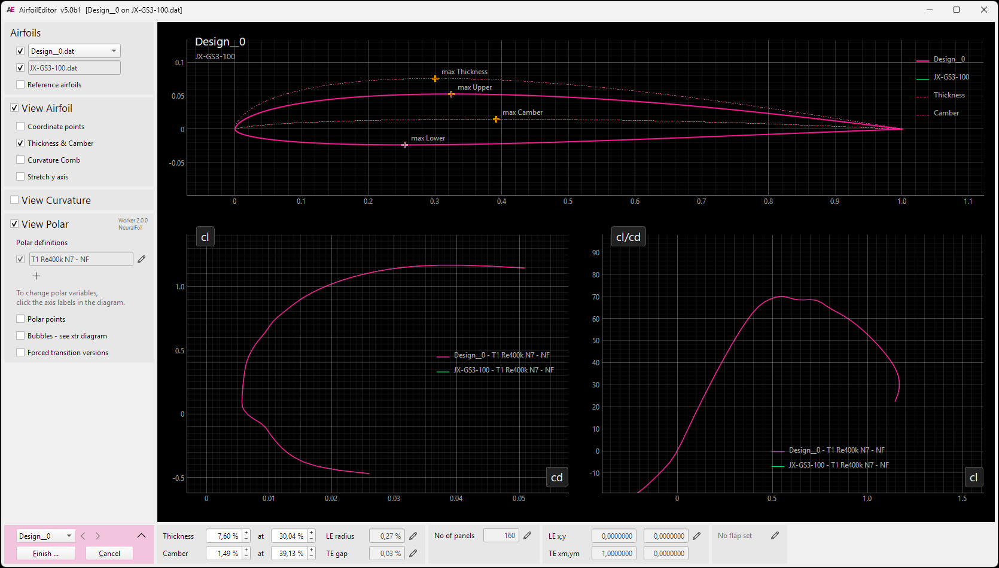

"Wie cool ist das denn!" rutschte es mir heraus, als nach dem entscheidenden Durchstich bei der Integration von NeuralFoil die erste Polare auf dem Bildschirm erschien. Diese Begeisterung ist auch nach einigen Wochen Detailarbeit geblieben. 

Schon bisher hat der AirfoilEditor neue Polaren bei Profiländerungen oder beim Blättern durch Profile möglichst automatisch im Hintergrund erzeugt. Mit NeuralFoil wird daraus jedoch eine ganz neue Benutzererfahrung, wenn es um das Zusammenspiel von Profilgeometrie und aerodynamischen Eigenschaften geht... 

Mit Version 5.0 verändert sich genau dieses Zusammenspiel von Profilgeometrie und Aerodynamik. Die Polare wird zu etwas, das beim Arbeiten an Profilen einfach da ist...

# AirfoilEditor 5.0

In dieser neuen Version dreht sich fast alles um Profilpolaren. Neben der Berechnung einer Polare mit XFOIL gibt es nun eine zweite Möglichkeit, die Polare eines Profils zu ermitteln: NeuralFoil.

NeuralFoil ist kein Ersatz für XFOIL. XFOIL bleibt weiterhin die bewährte Referenz für die detaillierte Rechnung. NeuralFoil ergänzt es dort, wo Geschwindigkeit den Unterschied macht: beim Erkunden, Vergleichen und Verändern von Profilen.

Für NeuralFoil werden zwei neue Konzepte bzw. Bausteine eingeführt:

* **CST-Kulfan** beschreibt ein Profil mit wenigen, gut formbaren Parametern.
* **NeuralFoil** liefert Polaren eines mit CST-Kulfan beschriebenen Profils.

Zunächst schauen wir uns diese beiden Konzepte etwas näher an, um dann schnell in die praktische Anwendung überzugehen. 

## CST-Kulfan Profilparametrisierung

Vielleicht klingt CST zunächst nach einem weiteren Dateiformat. Dahinter steckt aber eine sehr praktische Beschreibung einer Profilkontur. CST steht für *Class-Shape Transformation*. Die Grundform, die Klasse, sorgt für das typische Aussehen eines Profils mit runder Nase und spitzer Hinterkante. Die eigentliche Kontur entsteht durch eine Formfunktion, deren Gewichte die obere und untere Profilseite festlegen.

Vereinfacht lässt sich die Kontur so schreiben: $y(x) = C(x) \cdot S(x) + y_{TE}(x)$.

Die Klassenfunktion $C(x)$ liefert die grundsätzliche Profilcharakteristik, $S(x)$ wird durch die Shape-Gewichte geformt, und der letzte Term berücksichtigt bei Bedarf die Hinterkantendicke. Mit wenigen Gewichten lässt sich so eine glatte, gut kontrollierbare Profilform beschreiben.

Für NeuralFoil werden pro Seite acht Shape-Gewichte definiert. Jedes Gewicht bestimmt den Beitrag eines Bernsteinpolynoms zur Gesamtform.

Die Vorteile von CST-Kulfan-basierten Profilen sind:

1. Die Profilkontur wird grundsätzlich glatt und gut fließend. Die verwendeten Grundfunktionen erzeugen keine harten Knicke.

2. Änderungen an einzelnen Gewichten lassen sich bestimmten Bereichen des Profils gut zuordnen. Obwohl die mathematische Basis global ist, kann man damit gezielt Profilvarianten erzeugen. Das macht CST für Prototyping, erste Optimierungen und Feintuning besonders angenehm.

Die CST-Kulfan-Parametrisierung hat jedoch auch eine grundsätzliche Einschränkung:

Moderne Profile haben oft eine ausgeprägte, eng gekrümmte Nasenregion mit asymmetrischem Krümmungsverlauf auf Ober- und Unterseite. Die Klassenfunktion legt das Verhalten an der Vorderkante fest. Der zusätzliche `le_weight` und auch mehr Shape-Gewichte können diese durch die Wölbung verursachte Asymmetrie daher nur begrenzt abbilden.

Die CST-Kontur fällt im Nasenbereich deshalb gelegentlich etwas runder aus. Versucht man, diesen Unterschied allein mit den Shape-Gewichten auszugleichen, kann die gewünschte C2-Stetigkeit der Krümmung verloren gehen. Je nach Ausgangsprofil beeinflusst dies den Verlauf der Polare im oberen cl-Bereich und den berechneten Abrisspunkt.

CST-, Bezier- und B-Spline-basierte Profile sind miteinander verwandt: Alle beschreiben die Profilkontur mit wenigen Parametern statt mit einer langen Liste von Stützstellen. Sie haben jedoch unterschiedliche Stärken und Einsatzgebiete:

- CST-Kulfan: Prototyping, erste Optimierung, NeuralFoil
- Bezier: Finale Optimierung
- B-Spline: Übergang zu CAD

Im AirfoilEditor lässt sich ein CST-basiertes Profil einfach aus einem bestehenden Profil erzeugen und als neues Profil mit der Dateiendung `.cst` speichern und laden. Die Profilkontur kann durch Verschieben der Gewichtswerte spielerisch verändert werden.

Neben dieser expliziten CST-Umwandlung gibt es auch eine implizite Umwandlung im Hintergrund: Jedes Mal, wenn für ein Profil eine NeuralFoil-Polare benötigt wird, entsteht temporär eine CST-Version des Profils. 

Nachdem wir nun das Profil mit CST-Kulfan vorbereitet haben, können wir uns der eigentlichen Frage zuwenden:

## Was ist NeuralFoil?

[NeuralFoil](https://github.com/peterdsharpe/NeuralFoil) ist ein von Peter Sharpe genial entwickeltes, trainiertes neuronales Netzwerk zur Vorhersage von Profilpolaren. 
Das Netzwerk wurde mit tausenden Profilen und nahezu acht Millionen XFOIL-Berechnungen auf einem Hochleistungsrechner trainiert. Aus diesen Beispielen hat das neuronale Netz gelernt, wie Profilgeometrie, Reynolds-Zahl, Ncrit und weitere Randbedingungen mit der jeweiligen Polare zusammenhängen.

Spannend und wichtig dabei ist: Für jede neue Polare wird keine vollständige XFOIL-Rechnung durchgeführt. Das neuronale Netzwerk hat vielmehr anhand der Trainingsdaten gelernt, die Ergebnisse einer XFOIL-Rechnung für ein Profil und die jeweiligen Randbedingungen sehr schnell vorherzusagen. Nach wie vor ist das inzwischen rund 40 Jahre alte XFOIL eine wichtige Referenz für die 2D-Polarenermittlung.

Das abgebildete NeuralFoil-Logo veranschaulicht übrigens sehr schön den Ansatz: Aus den gelben Angaben zur "Geometrie" entsteht im Netzwerk eine Vorhersage der blauen "Polare".

Soll für ein Profil eine Polare ermittelt werden, bekommt das neuronale Netz die Profilgeometrie in Form von CST-Kulfan und die Randbedingungen wie Reynolds-Zahl, Ncrit, vorgegebene Umschlagspunkte und Anstellwinkel und liefert daraus unter anderem Auftrieb cl, Widerstand cd, Moment cm und die laminar-turbulenten Umschlagspunkte.

Im Unterschied zu XFOIL steht eine typische Polare bereits nach wenigen Millisekunden zur Verfügung. Das macht NeuralFoil besonders hilfreich für Fragen wie diese:

* Was passiert, wenn der Dickenrückstand etwas nach hinten wandert?
* Wie verändert eine kleine Wölbungsänderung den Widerstand bei meiner Reynolds-Zahl?
* Lohnt sich ein Blick auf diese Profilvariante überhaupt, bevor ich sie genauer rechne?

Die Antwort erscheint nicht erst nach einer kurzen "Denkpause", sondern während man noch an der Geometrie arbeitet.

### Die NeuralFoil-Modelle

NeuralFoil bringt nicht nur ein einziges Netzwerk mit, sondern acht Modelle unterschiedlicher Größe - von `xxsmall` bis `xxxlarge`. Sie unterscheiden sich in der Anzahl und Breite der Schichten und damit darin, wie fein die Zusammenhänge aus den Trainingsdaten abgebildet werden.

Die Modellgröße kann in der Polaren-Definition ausgewählt werden. Sie ist ein Kompromiss zwischen Rechenzeit und Genauigkeit:

- Die kleinen Modelle liefern eine komplette Polare in etwa 2 ms, die größten benötigen rund 15 ms. Beides ist im Vergleich zu XFOIL sehr schnell.
- Die Genauigkeit gegenüber einer XFOIL-Rechnung steigt mit der Modellgröße deutlich. Beim Widerstand liegt die typische Abweichung bei den kleinen Modellen im Bereich einiger Prozent, bei den großen Modellen nur noch bei rund zwei Prozent.

Im AirfoilEditor ist `xlarge` voreingestellt. Dieses Modell bietet für die tägliche Arbeit eine gute Genauigkeit, ohne dass die Polare spürbar langsamer erscheint. 

NeuralFoil liefert sehr schnelle und in vielen Fällen erstaunlich gute Vorhersagen. Dennoch gilt wie bei jedem datenbasierten Modell: Die Aussagekraft ist innerhalb des Bereichs am größten, den das Modell aus seinen Trainingsdaten kennt. Der AirfoilEditor berücksichtigt deshalb die von NeuralFoil gelieferte Vorhersage-Sicherheit und blendet Betriebspunkte mit zu geringer Sicherheit aus. Insbesondere nahe cl_max oder bei ungewöhnlichen Geometrien lohnt weiterhin der Vergleich mit einer XFOIL-Polare. NeuralFoil ist ein toller Begleiter für den Entwurf, ersetzt aber nicht die kritische Beurteilung der Ergebnisse.

### Einschränkungen gegenüber der XFOIL-Berechnung

Gegenüber einer XFOIL-Polare gibt es im AirfoilEditor Einschränkungen, die sich unmittelbar aus dem Training des Netzwerks ergeben:

- Keine T2-Polare: NeuralFoil liefert ausschließlich T1-Polaren mit fester Reynolds-Zahl. Für eine T2-Polare mit konstantem Auftrieb wird weiterhin XFOIL benötigt.
- Keine Mach-Zahl: Die Vorhersage gilt für inkompressible Strömung, die Mach-Zahl ist auf 0.0 festgelegt. Kompressibilitätseffekte werden also nicht berücksichtigt.
- Keine Anzeige von Ablöseblasen im xtr-Diagramm: Diese Darstellung beruht auf der Wandschubspannung der einzelnen XFOIL-Panels. NeuralFoil liefert diese Größe nicht.

In der Polaren-Definition sind die entsprechenden Felder deshalb inaktiv, sobald NeuralFoil als 'Polar driver' gewählt wird.

## NeuralFoil in Aktion

Die Nutzung von NeuralFoil beginnt ganz unspektakulär: In der 'Polar-Definition' wird als 'Polar driver' anstatt XFOIL nun **NeuralFoil** ausgewählt.

Mit der Auswahl beginnt in diesem Dialog bereits das Live-Update der Polaren. Dazu einfach einmal mit dem Maus-Scroll-Rad beispielsweise Re-Zahl oder Ncrit verändern ...

*Anmerkung: Wenn man dies zum ersten Mal sieht, reibt man sich verdutzt die Augen. Magic!*

Mit NeuralFoil wird die Interaktion zwischen einer Profil-Modifikation und der zugehörigen Polare zu einem ganz neuen Erlebnis. Man bekommt den Eindruck, eine Polare förmlich "hinbiegen" zu können. 

In diesem Beispiel werden die Dicke und die Dickenrücklage eines Profils interaktiv verändert.

Hilfreich ist es, neben der NeuralFoil-Polare eine zweite Polare mit den gleichen Einstellungen, aber mit XFOIL als Treiber zu definieren. Am Ende einer interaktiven Modifikation wird die XFOIL-Polare dann automatisch berechnet, sodass man stets den aktuellen Vergleich beider Verfahren vor Augen hat.

NeuralFoil eignet sich perfekt, um einen ersten Entwurf eines Profils zu machen oder um schnelle Vergleiche zwischen verschiedenen Profilen bei unterschiedlichen Re-Zahlen oder Ncrit zu ermöglichen. 

Das Fine-Tuning erfolgt dann wie bisher auf Basis der XFOIL-Polare.

## Weitere Neuerungen in 5.0

Neben den zentralen Erweiterungen rund um NeuralFoil wurden in der neuen Version zahlreiche kleine Verbesserungen und Korrekturen umgesetzt. Ein Großteil davon auch "hinter den Kulissen".

Ein Feature ist aus Anwendungssicht bemerkenswert: Die Berechnung der veränderten Profil-Geometrie beim Setzen einer Klappe geschieht nun im AirfoilEditor selbst, statt die entsprechende XFOIL-Routine aufzurufen. Damit entfällt für diese Aufgabe die Abhängigkeit von der separaten Worker-Anwendung - und das Setzen einer Klappe fühlt sich spürbar flüssiger an. 

*Tipp: Beim Setzen einer Klappe zusätzlich eine NeuralFoil-Polare einblenden - so lässt sich die Wirkung des Klappenausschlags direkt mitverfolgen.* 

## Dank

Mein besonderer Dank gilt [Peter Sharpe](https://github.com/peterdsharpe) für NeuralFoil. Das Projekt ist in meinen Augen ein Meilenstein in der interaktiven Profilanalyse - und dass er es offen und frei verfügbar macht, hat die Integration in den AirfoilEditor überhaupt erst möglich gemacht.

## Installation

Zum Zeitpunkt dieses Beitrags ist die Version 5.0 als Beta verfügbar. Die finale Version erscheint, wenn die hoffentlich zahlreichen Rückmeldungen eingearbeitet wurden.

Die Windows-Installation steht als Installer auf der [Release-Seite des AirfoilEditor](https://github.com/jxjo/AirfoilEditor/releases) bereit. 

Auf Linux und macOS kann die Beta-Version als Clone oder Copy lokal installiert werden. Siehe dazu den Abschnitt [Installation im README](https://github.com/jxjo/AirfoilEditor#installation).

Ich bin gespannt, ob sich die erste Begeisterung im Profil-Designer-Alltag bewährt. Am Bildschirm fühlt es sich jedenfalls schon jetzt so an, als seien Profil und Polare ein Stück zusammengerückt.

Viel Freude mit 5.0 🚀 

Jochen 